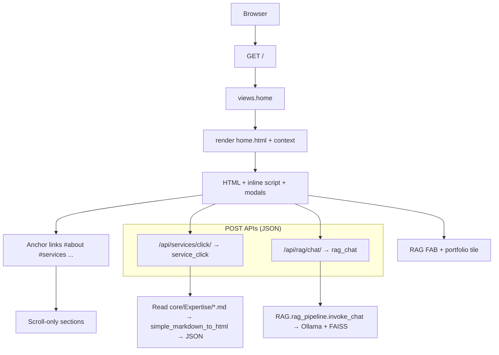

# Website code flow

## 1. High-level architecture

| Layer | Role |
|--------|------|
| **URLs** | `CraftedBySharath/urls.py` mounts `core.urls` at `/`. Admin lives at `/admin/`. |
| **Views** | `core/views.py` serves the home page and two JSON APIs. |
| **Templates** | `core/templates/core/home.html` is the entire public site (one template). |
| **Static assets** | `core/static/` — CSS, JS, images, optional demo videos under `core/static/videos/`. |
| **RAG** | `RAG/rag_pipeline.py` — in-process LangChain + FAISS + Ollama; invoked only from `rag_chat`. |

**Single entry for visitors:** `GET /` → `views.home` → `core/home.html`.

---

## 2. Request flow (diagram)

---

## 3. URL → view → template mapping

| URL | HTTP | View | Output |
|-----|------|------|--------|
| `/` | GET | `core.views.home` | Full portfolio HTML |
| `/api/services/click/` | POST | `core.views.service_click` | JSON: `title`, `html`, `markdown` |
| `/api/rag/chat/` | POST | `core.views.rag_chat` | JSON: `answer` or `error` |

---

## 4. `home` view — server-side context

**File:** `core/views.py` — function `home`.

The view builds **skill data** (ML, web, languages) as dictionaries of name → percentage strings, passes **`skill_groups`** and **`languages`** to the template, and scans **`core/static/videos/`** for video filenames (`_list_cv_demo_video_filenames()`). Those filenames drive the CV demo modal (if any files exist).

Everything else on the page is **static in the template** (copy, structure, external links).

---

## 5. Page sections (scroll order — what to show on video)

These are **in-document anchors** from the navbar (`href="#about"`, etc.). No extra routes.

| Section ID | Content type | Code notes |
|------------|----------------|------------|
| `#top` / hero | Static | Intro, social links, “Get In Touch” → `#contact` |
| `#about` | Static | Bio, contact strip |
| `#services` | **Interactive** | Buttons `.service-icon-btn` with `data-service` → see §6 |
| `#skills` | Server-driven bars | Progress width from `data-width`; inline script sets `style.width` |
| `#portfolio` | Mixed | RAG tile, CV tile, external links, lightbox |
| `#experience` | Static | Cards + resume link |
| `#testimonials` | Static | Quotes |
| `#contact` | External form | `POST` to Formspree (`action="https://formspree.io/..."`) — not Django |

**Portfolio column (important for the demo story):**

- **RAG** — `a.rag-chat-trigger`: opens Bootstrap modal, chat hits `/api/rag/chat/` (§7).
- **Computer Vision** — `a.cv-video-trigger` (disabled if no videos): opens CV video modal; filenames from `home` context.
- **Model Zoo** — external Hugging Face collection.
- **Web Development** — `a.portfolio-lightbox`: **BigPicture** gallery in `main.js` (not the RAG tile).

---

## 6. Expertise popups (services) — code flow

1. User clicks a **service icon** (e.g. `data-service="ai_ml"`).
2. **Inline script** in `home.html` (IIFE at bottom) `fetch`es **`POST /api/services/click/`** with JSON `{"section": "<key>"}` and **CSRF** header.
3. **`service_click`** (`views.py`) validates `section` against `SERVICE_CONTENT_MAP`, reads matching markdown from **`core/Expertise/<filename>`**, strips the first `#` title line (modal already shows title), runs **`simple_markdown_to_html`**, returns JSON.
4. Client **`openServicePopup`** fills `#servicePopup` (included from `core/service_popup.html`) and shows a Bootstrap modal.

**Video angle:** Show one icon click → modal content appearing; mention content lives in markdown files on the server.

---

## 7. Portfolio RAG chat — code flow

**Trigger:** Any `.rag-chat-trigger` (portfolio tile or floating **FAB** `#ragChatFab`).

1. Click opens **`#ragChatModal`** (`core/rag_chat_modal.html`).
2. On submit, inline script **`fetch` POST `/api/rag/chat/`** with `{"message": "..."}` + CSRF.
3. **`rag_chat`** imports **`invoke_chat`** from `RAG.rag_pipeline` (lazy import). Missing deps → **503** with install hint.
4. **`invoke_chat`** → **`ensure_rag_ready()`**:
   - If **`RAG_INDEX_DIR`** has files → **`load_index()`** (FAISS + embeddings).
   - Else **`build_index()`** from documents under **`RAG_DOCS_DIR`** (PDF/TXT/MD).
5. **`ConversationalRetrievalChain`** (LangChain) calls **Ollama** at **`RAG_OLLAMA_BASE_URL`** with **`RAG_OLLAMA_MODEL`**; answers return as JSON **`answer`**.
6. UI appends bubbles to `#ragChatMessages`; errors show as error-styled bubbles.

**Ops note for recording:** Ollama must be running with the configured model; index can be pre-built with `python manage.py ingest_rag` (see `core/management/commands/ingest_rag.py`).

**Settings** (env-overridable): `RAG_DOCS_DIR`, `RAG_INDEX_DIR`, `RAG_OLLAMA_*`, `RAG_EMBED_MODEL`, chunk/top-k — see `CraftedBySharath/settings.py`.

---

## 8. CV demo videos modal — code flow

1. **`home`** passes **`cv_videos`** = list of filenames in `core/static/videos/` (allowed extensions).
2. If empty, the CV tile gets class **`disabled`** and `aria-disabled`.
3. On open (`shown.bs.modal`), the main `<video>` source is set from the first asset; **thumbnails** `.cv-video-thumb` swap `src` and call **`load()`** / **`play()`**.

Template: `core/cv_video_modal.html` (included in `home.html`).

---

## 9. Client-side scripts (non-API behavior)

| File | Responsibility |
|------|----------------|
| `core/static/scripts/main.js` | **AOS** init on load; **navbar** fixed + scroll-top button; **Masonry** on `.grid` after **imagesLoaded**; **BigPicture** for `[data-bigpicture]` and `.portfolio-lightbox`. |
| `core/static/scripts/copy_email.js` | **`copyEmail()`** — clipboard + tooltip (header/footer). |
| `home.html` (inline) | CSRF helper; **service** fetch + modal; **RAG** fetch + modal; **CV** modal + thumbnails; **progress bar** width from `data-width`. |

RAG tile **excludes** the portfolio lightbox gallery (see comment in `main.js` — selectors differ on purpose).

---

## 10. File checklist for producers

| Topic | Primary files |
|-------|----------------|
| Routing | `CraftedBySharath/urls.py`, `core/urls.py` |
| Page + APIs | `core/views.py` |
| Markup + behavior | `core/templates/core/home.html` |
| Modals | `core/templates/core/rag_chat_modal.html`, `cv_video_modal.html`, `service_popup.html` |
| RAG implementation | `RAG/rag_pipeline.py`, `RAG/docs/` (content) |
| Service copy source | `core/Expertise/*.md` |
| Index rebuild | `python manage.py ingest_rag` |
| UI polish | `core/static/scripts/main.js`, `main.css` |

